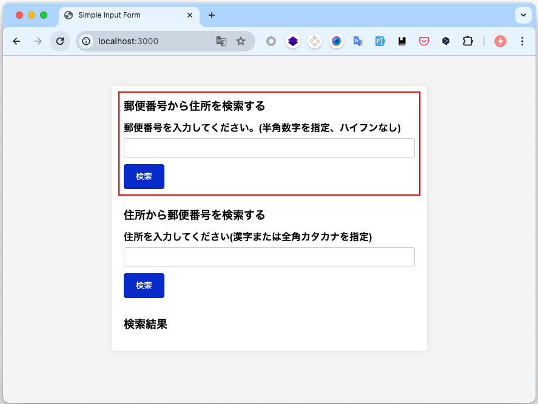

# 2-2. 郵便番号検索 API を利用した Web アプリケーションの構築

住所検索に関係するアプリを作成してください。

本文の回答には`ans-0202`というディレクトリを作成し、その中に配置してください。

## 目次

- [2-2. 郵便番号検索 API を利用した Web アプリケーションの構築](#2-2-郵便番号検索-api-を利用した-web-アプリケーションの構築)
  - [目次](#目次)
  - [簡易的な環境構築](#簡易的な環境構築)
    - [フロントエンド環境の立ち上げ](#フロントエンド環境の立ち上げ)
  - [データベース](#データベース)
    - [テーブル定義](#テーブル定義)
  - [2-2-1.郵便番号から住所を検索する API](#2-2-1郵便番号から住所を検索する-api)
    - [2-2-1 の API の仕様](#2-2-1-の-api-の仕様)
      - [2-2-1 の URL の例](#2-2-1-の-url-の例)
    - [2-2-1 のレスポンス](#2-2-1-のレスポンス)
      - [2-2-1 のレスポンス例](#2-2-1-のレスポンス例)
    - [2-2-1 のシーケンス図](#2-2-1-のシーケンス図)
    - [2-2-1 のフロー図](#2-2-1-のフロー図)
  - [2-2-2.フロントエンドへの表示](#2-2-2フロントエンドへの表示)
    - [2-2-2 の仕様](#2-2-2-の仕様)
    - [2-2-2 のシーケンス図](#2-2-2-のシーケンス図)
  - [2-2-3. 住所から郵便番号を検索する API](#2-2-3-住所から郵便番号を検索する-api)
    - [2-2-3 の API の仕様](#2-2-3-の-api-の仕様)
      - [2-2-3 の URL の例](#2-2-3-の-url-の例)
    - [2-2-3 のレスポンス](#2-2-3-のレスポンス)
      - [2-2-3 のレスポンス例](#2-2-3-のレスポンス例)
    - [2-2-3 のシーケンス図](#2-2-3-のシーケンス図)
    - [2-2-3 のフロー図](#2-2-3-のフロー図)
  - [2-2-4. フロントエンドへの表示](#2-2-4-フロントエンドへの表示)
    - [2-2-4 の仕様](#2-2-4-の仕様)
    - [2-2-4 のシーケンス図](#2-2-4-のシーケンス図)

## 簡易的な環境構築

本問はすでに簡易的な環境が整備されているフロントエンドと、データベースが用意されています。
上記を利用し、バックエンドサーバーを実装することが求められます。

### フロントエンド環境の立ち上げ

フロントエンド環境の立ち上げには Docker を使用します。以下の手順でフロントエンド環境を立ち上げてください。

```bash
$ docker-compose up -d
```

## データベース

郵便番号や住所などの情報はデータベース`app.db`に格納されています。データベースエンジンは[SQLite](https://www.sqlite.org/index.html)で付属の`app.db`にデータを格納します。

もし必要なら SQLite をインストールしてください。SQLite がインストールされているかどうかは下記のコマンドで確認できます。`$`はシェルのプロンプトを表します。

```bash
$ sqlite3 --version
3.39.5 2022-10-14 20:58:05 554764a6e721fab307c63a4f98cd958c8428a5d9d8edfde951858d6fd02daapl
```

### テーブル定義

`app.db`には`addresses`テーブルがあり、以下のようなテーブル定義となっています。

| カラム名     | 型      | 備考                     | 制約                                                  |
| ------------ | ------- | ------------------------ | ----------------------------------------------------- |
| id           | INTEGER | 住所 ID                  | 主キー、AUTO INCREMENT                                |
| zip_code     | TEXT    | 郵便番号                 | 7 桁の半角数字で構成される文字列。NOT NULL 制約である |
| pref_kana    | TEXT    | 都道府県名(全角カタカナ) | NOT NULL 制約である                                   |
| city_kana    | TEXT    | 市区町村名(全角カタカナ) | NOT NULL 制約である                                   |
| section_kana | TEXT    | 町域名(全角カタカナ)     |                                                       |
| pref         | TEXT    | 都道府県名               | NOT NULL 制約である                                   |
| city         | TEXT    | 市区町村名               | NOT NULL 制約である                                   |
| section      | TEXT    | 町域名                   |                                                       |

またすでに`addresses`テーブルレコードが格納されていて、データの内容は`addresses.csv`に格納されています。

## 2-2-1.郵便番号から住所を検索する API

- 郵便番号から住所を検索する機能を API を作成してください。
- 検索結果が複数ある場合は、最初にヒットした住所をレスポンスとして返却してください。
- クエリパラメータが指定されていない場合は、`400 Bad Request`を返却してください。
- 検索結果がない場合は、`204 No Content`を返却してください。
- バックエンドサーバーの URL は`http://localhost:4000`とします。
- 本問の回答に外部ライブラリを使用しても構いません。
- 本問の回答には`ans-0202`というディレクトリを作成し、その中に配置してください。

### 2-2-1 の API の仕様

- リクエスト URL: `/api/address`
- メソッド: `GET`
- クエリパラメータ

| パラメータ名 | 型     | 備考                   |
| ------------ | ------ | ---------------------- |
| zipcode      | 文字列 | 郵便番号に対応する住所 |

#### 2-2-1 の URL の例

```txt
http://localhost:4000/api/address?zipcode=7900003
```

### 2-2-1 のレスポンス

郵便番号に対応する住所が見つかった場合は、以下のようなレスポンスを返却してください。

- ステータスコード: `200 OK`
- レスポンスボディの形式は JSON 形式とします。
- レスポンスボディ

| プロパティ名 | 型     | 備考                     |
| ------------ | ------ | ------------------------ |
| zip_code     | 文字列 | 郵便番号                 |
| pref_kana    | 文字列 | 都道府県名(全角カタカナ) |
| city_kana    | 文字列 | 市区町村名(全角カタカナ) |
| section_kana | 文字列 | 町域名(全角カタカナ)     |
| pref         | 文字列 | 都道府県名               |
| city         | 文字列 | 市区町村名               |
| section      | 文字列 | 町域名                   |

#### 2-2-1 のレスポンス例

```json
{
  "zip_code": "7900003",
  "pref_kana": "エヒメケン",
  "city_kana": "マツヤマシ",
  "section_kana": "サンバンチョウ",
  "pref": "愛媛県",
  "city": "松山市",
  "section": "三番町"
}
```

### 2-2-1 のシーケンス図

```Mermaid
sequenceDiagram
    actor User
    participant Backend
    participant DataBase

    User ->> Backend: リクエストを送信<br>(GET http://localhost:4000/api/address?zipcode=XXXXXXX)
    Backend ->> DataBase: 入力された情報を利用して<br>住所を問い合わせる
    DataBase ->> Backend: 結果をバックエンドに返す
    Backend ->> User: データベースから受け取った内容をレスポンスとして<br>ユーザーに返す
```

### 2-2-1 のフロー図

```Mermaid
graph TD
  Start[開始] --> A[リクエストの受付]
  A --> B{"必要なクエリパラメータが\n存在しているか"}
  B -->|YES| C["ユーザーが入力した郵便番号を利用して\nデータベースを検索する"]
  B -->|NO| D[ステータスコード400を返却する]
  C --> E{検索結果が1件以上あるか}
  E -->|YES| F[検索結果の1件目を取り出す]
  E -->|NO| G[ステータスコード204を返却する]
  F --> H[検索結果をステータスコード200で返却する]
  D --> End[終了]
  G --> End
  H --> End
```

## 2-2-2.フロントエンドへの表示

- 2-2-1 で作成した API を利用して、郵便番号から住所を検索する機能をフロントエンド画面に実装してください。
- フロントエンド画面は HTML、CSS、JavaScript を使用してください。
- 入力に必要な UI は実装済みの画面が`frontend/app`ディレクトリの`index.html`にあるため、この画面を利用してください。
- JavaScript の実装は`frontend/app`ディレクトリの`app.js`に実装してください。
- 本問の解答には外部ライブラリを使用しても構いません。



### 2-2-2 の仕様

- ユーザーが赤枠で囲まれた入力欄に郵便番号を入力し、「検索」ボタンを押下すると、入力された郵便番号に対応する住所を表示します。
- 住所が見つからない場合は「住所が見つかりませんでした。」と表示してください。
- 住所が見つかった場合は、画面下部の「検索結果」の下側に以下のように表示してください。

```txt
〒790-0003
愛媛県松山市三番町 (エヒメケン マツヤマシ サンバンチョウ)
```

### 2-2-2 のシーケンス図

```Mermaid
sequenceDiagram
    actor User
    participant Frontend
    participant Backend
    participant DataBase

    User ->> User: 画面に郵便番号を入力
    User ->> Frontend: 「検索」ボタンを押下
    Frontend ->> Backend: リクエストを送信<br>(GET http://localhost:4000/api/address?zipcode=XXXXXXX)
    Backend ->> DataBase: 入力された情報を利用して<br>住所を問い合わせる
    DataBase ->> Backend: 結果をバックエンドに返す
    Backend ->> Frontend: データベースから受け取った内容をレスポンスとして<br>フロントエンドに返す
    Frontend ->> User: 検索結果を画面に表示する
```

## 2-2-3. 住所から郵便番号を検索する API

- 住所から郵便番号を検索する機能を API を作成してください。
- 検索結果が複数ある場合は、最初にヒットした住所をレスポンスとして返却してください。
- クエリパラメータが指定されていない場合は、`400 Bad Request`を返却してください。
- 検索結果がない場合は、`204 No Content`を返却してください。
- バックエンドサーバーの URL は`http://localhost:4000`とします。
- 本問の回答には外部ライブラリを使用しても構いません。
- 本文の回答は[2-2-1 郵便番号から住所を検索する API](#2-2-1郵便番号から住所を検索する-api)と同じファイルに記述してください。

### 2-2-3 の API の仕様

- リクエスト URL: `/api/zipcode`
- メソッド: `GET`
- クエリパラメータ

| パラメータ名 | 型     | 備考       |
| ------------ | ------ | ---------- |
| pref         | 文字列 | 都道府県名 |
| city         | 文字列 | 市区町村名 |
| section      | 文字列 | 町域名     |

#### 2-2-3 の URL の例

```txt
http://localhost:4000/api/zipcode?pref=愛媛県&city=松山市&section=三番町
```

### 2-2-3 のレスポンス

住所に対応する郵便番号が見つかった場合は、以下のようなレスポンスを返却してください。

- ステータスコード: `200 OK`
- レスポンスボディの形式は JSON 形式とします。
- レスポンスボディ

| プロパティ名 | 型     | 備考     |
| ------------ | ------ | -------- |
| zip_code     | 文字列 | 郵便番号 |

#### 2-2-3 のレスポンス例

```json
{
  "zip_code": "7900003"
}
```

### 2-2-3 のシーケンス図

```Mermaid
sequenceDiagram
    actor User
    participant Backend
    participant DataBase

    User ->> Backend: リクエストを送信<br>(GET http://localhost:4000/api/zipcode?pref=XXX#amp;city=YYY#amp;section=ZZZ)
    Backend ->> DataBase: 入力された情報を利用して<br>郵便番号を問い合わせる
    DataBase ->> Backend: 結果をバックエンドに返す
    Backend ->> User: データベースから受け取った内容をレスポンスとして<br>ユーザーに返す
```

### 2-2-3 のフロー図

```Mermaid
graph TD
  Start[開始] --> A[リクエストの受付]
  A --> B{"必要なクエリパラメータが\n存在しているか"}
  B -->|YES| C["ユーザーが入力した住所を利用して\nデータベースを検索する"]
  B -->|NO| D[ステータスコード400を返却する]
  C --> E{検索結果が1件以上あるか}
  E -->|YES| F[検索結果の1件目を取り出す]
  E -->|NO| G[ステータスコード204を返却する]
  F --> H[検索結果をステータスコード200で返却する]
  D --> End[終了]
  G --> End
  H --> End
```

## 2-2-4. フロントエンドへの表示

- 2-2-3 で作成した API を利用して、住所から郵便番号を検索する機能をフロントエンド画面に実装してください。
- フロントエンド画面は HTML、CSS、JavaScript を使用してください。
- 入力に必要な UI は実装済みの画面が`frontend/app`ディレクトリの`index.html`にあるため、この画面を利用してください。
- JavaScript の実装は`frontend/app`ディレクトリの`app.js`に実装してください。
- 本問の回答に外部ライブラリを使用しても構いません。
- 本文の回答は[#2-2-2 フロントエンドへの表示](#2-2-2フロントエンドへの表示)と同じファイルに記述してください。


### 2-2-4 の仕様

- ユーザーが赤枠で囲まれた入力欄に住所を入力し、「検索」ボタンを押下すると、入力された住所に対応する郵便番号を表示します。
- 郵便番号が見つからない場合は「郵便番号が見つかりませんでした。」と表示してください。
- 郵便番号が見つかった場合は、画面下部の「検索結果」の下側に以下のように表示してください。

```txt
〒790-0003
愛媛県松山市三番町 (エヒメケン マツヤマシ サンバンチョウ)
```

### 2-2-4 のシーケンス図

```Mermaid
sequenceDiagram
    actor User
    participant Frontend
    participant Backend
    participant DataBase

    User ->> User: 画面に住所を入力
    User ->> Frontend: 「検索」ボタンを押下
    Frontend ->> Backend: リクエストを送信<br>(GET http://localhost:4000/api/zipcode?pref=XXX#amp;city=YYY#amp;section=ZZZ)
    Backend ->> DataBase: 入力された情報を利用して<br>郵便番号を問い合わせる
    DataBase ->> Backend: 結果をバックエンドに返す
    Backend ->> Frontend: データベースから受け取った内容をレスポンスとして<br>フロントエンドに返す
    Frontend ->> User: 検索結果を画面に表示する
```
