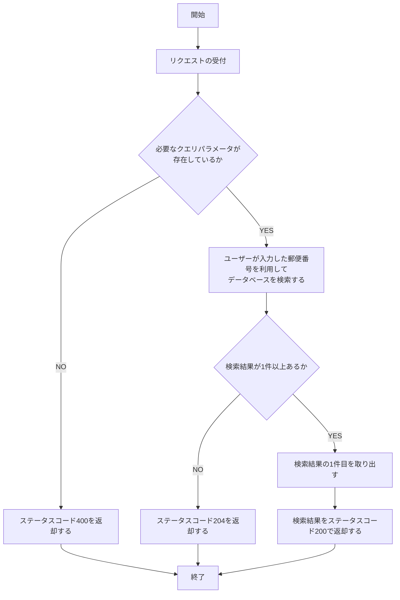
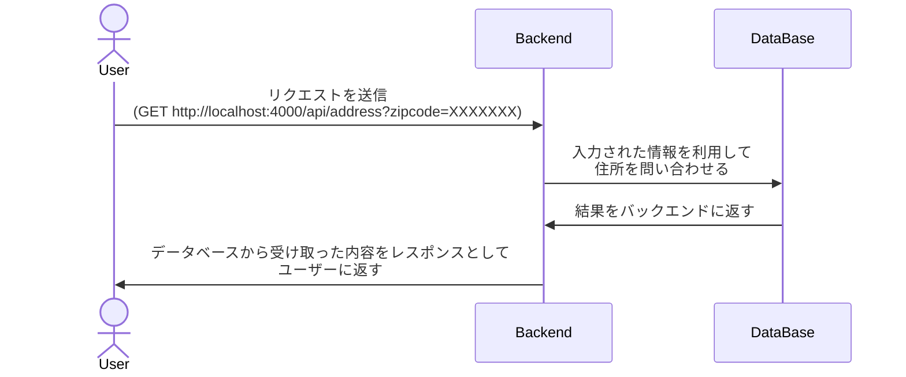
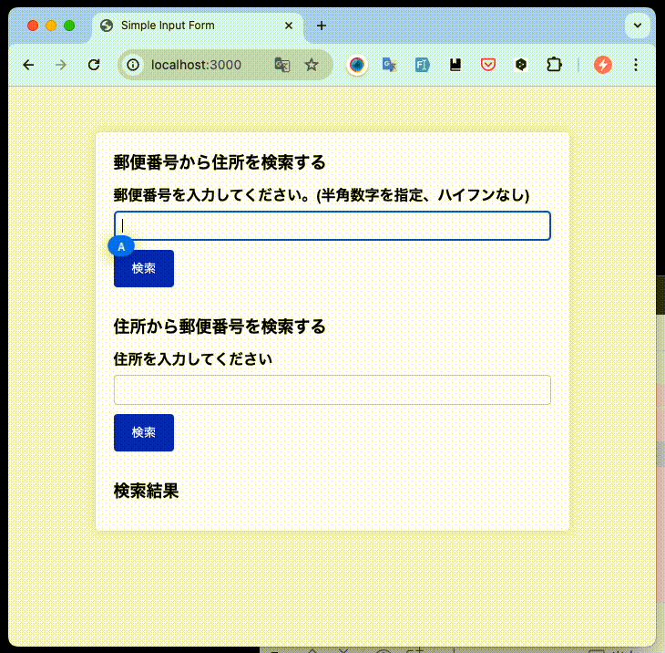
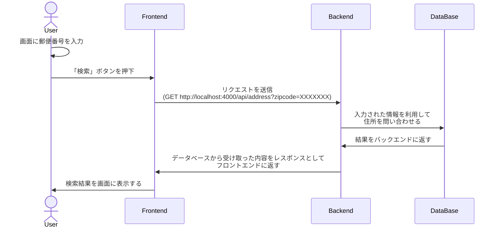

# A. 郵便番号から住所を検索する機能

- 郵便番号から住所を検索する機能を作成してください。
- 回答となるプログラムなどは`ans-0202`というディレクトリを作成し、その中に配置してください。

## 目次

- [A. 郵便番号から住所を検索する機能](#a-郵便番号から住所を検索する機能)
  - [目次](#目次)
  - [A-1. バックエンド API の実装](#a-1-バックエンド-api-の実装)
    - [バックエンド API の仕様](#バックエンド-api-の仕様)
      - [URL の例](#url-の例)
    - [レスポンス](#レスポンス)
      - [レスポンスの例](#レスポンスの例)
    - [API の処理フロー図](#api-の処理フロー図)
    - [バックエンド側のみのシーケンス図](#バックエンド側のみのシーケンス図)
  - [A-2. フロントエンドへの表示](#a-2-フロントエンドへの表示)
    - [フロントエンド側の仕様](#フロントエンド側の仕様)
    - [フロントエンドとバックエンドを組み合わせたシーケンス図](#フロントエンドとバックエンドを組み合わせたシーケンス図)

## A-1. バックエンド API の実装

- 郵便番号から住所を検索するバックエンド API を作成してください。
- バックエンドサーバーの URL は`http://localhost:4000`とします。
- 本問の回答に外部ライブラリやフレームワークを使用しても構いません。
- 必要次応じて、`app.db`を設置するディレクトリを変更しても構いません。
- 本問の回答には`ans-0202`というディレクトリを作成し、その中に配置してください。

### バックエンド API の仕様

- リクエスト URL: `/api/address`
- メソッド: `GET`
- クエリパラメータ

| パラメータ名 | 型     | 備考                   |
| ------------ | ------ | ---------------------- |
| zipcode      | 文字列 | 郵便番号に対応する住所 |

- 郵便番号検索は`zip_code`の完全一致で行うものとします。

#### URL の例

```txt
http://localhost:4000/api/address?zipcode=7900003
```

### レスポンス

郵便番号に対応する住所が見つかった場合は、以下のようなレスポンスを返却してください。

- ステータスコード: `200 OK`
- レスポンスボディの形式は JSON 形式とします。
- レスポンスボディ

| プロパティ名 | 型     | 備考                     |
| ------------ | ------ | ------------------------ |
| zip_code     | 文字列 | 郵便番号                 |
| pref_kana    | 文字列 | 都道府県名(全角カタカナ) |
| city_kana    | 文字列 | 市区町村名(全角カタカナ) |
| section_kana | 文字列 | 町域名(全角カタカナ)     |
| pref         | 文字列 | 都道府県名               |
| city         | 文字列 | 市区町村名               |
| section      | 文字列 | 町域名                   |

#### レスポンスの例

```json
{
  "zip_code": "7900003",
  "pref_kana": "エヒメケン",
  "city_kana": "マツヤマシ",
  "section_kana": "サンバンチョウ",
  "pref": "愛媛県",
  "city": "松山市",
  "section": "三番町"
}
```

### API の処理フロー図



### バックエンド側のみのシーケンス図



## A-2. フロントエンドへの表示

- A-1 で作成した API を利用して、郵便番号から住所を検索する機能をフロントエンド画面に実装してください。
- フロントエンド画面は HTML、CSS、JavaScript を使用してください。
- 入力に必要な UI は実装済みの画面が`frontend/app`ディレクトリの`index.html`にあるため、この画面を利用してください。
- JavaScript の実装は`frontend/app`ディレクトリの`app.js`に実装してください。
- 本問の解答には外部ライブラリやフレームワークを使用しても構いません。



### フロントエンド側の仕様

- ユーザーが入力欄に郵便番号を入力し、「検索」ボタンを押下すると、入力された郵便番号に対応する住所を表示します。
- 住所の上側にはユーザーが入力した郵便番号を表示してください。
- 住所が見つからない場合は「住所が見つかりませんでした。」と表示してください。
- 住所が見つかった場合は、画面下部の「検索結果」の下側に以下のように表示してください。

```txt
〒7900003
愛媛県松山市三番町
エヒメケン マツヤマシ サンバンチョウ
```

### フロントエンドとバックエンドを組み合わせたシーケンス図


