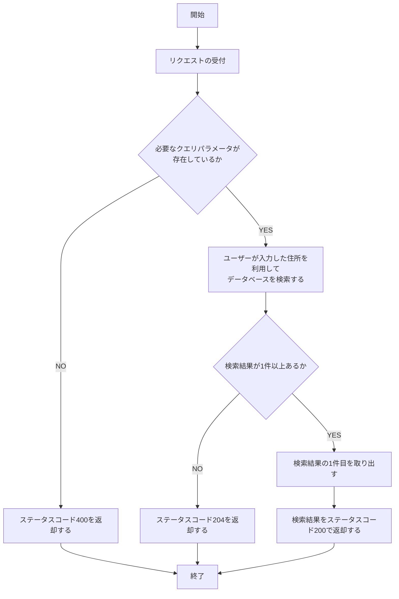
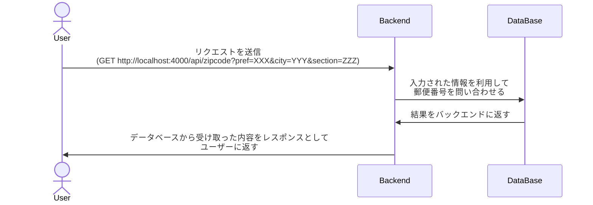
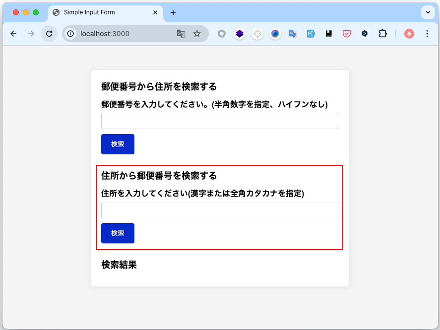
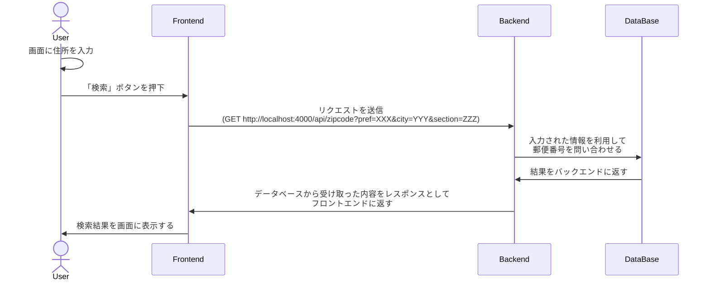

# B. 郵便番号から住所を検索する機能

- 住所から郵便番号を検索する機能を作成してください。
- 回答となるプログラムなどは`ans-0202`というディレクトリを作成し、その中に配置してください。

## 目次

- [B. 郵便番号から住所を検索する機能](#b-郵便番号から住所を検索する機能)
  - [目次](#目次)
  - [B-1. 住所から郵便番号を検索する API](#b-1-住所から郵便番号を検索する-api)
    - [バックエンド API の仕様](#バックエンド-api-の仕様)
      - [URL の例](#url-の例)
    - [レスポンス](#レスポンス)
      - [レスポンスの例](#レスポンスの例)
    - [API の処理フロー図](#api-の処理フロー図)
    - [シーケンス図](#シーケンス図)
  - [B-2. フロントエンドへの表示](#b-2-フロントエンドへの表示)
    - [フロントエンド側の仕様](#フロントエンド側の仕様)
    - [フロントエンドとバックエンドを組み合わせたシーケンス図](#フロントエンドとバックエンドを組み合わせたシーケンス図)

## B-1. 住所から郵便番号を検索する API

- 住所から郵便番号を検索する機能を API を作成してください。
- バックエンドサーバーの URL は`http://localhost:4000`とします。
- 本問の回答には外部ライブラリやフレームワークを使用しても構いません。
- 本問の回答は[A. 郵便番号から住所を検索する機能](./qst-0202-b.md)と同じファイルに記述してください。

### バックエンド API の仕様

- リクエスト URL: `/api/zipcode`
- メソッド: `GET`
- クエリパラメータ

| パラメータ名 | 型     | 備考       |
| ------------ | ------ | ---------- |
| address      | 文字列 | 住所を指定 |

#### URL の例

```txt
http://localhost:4000/api/zipcode?address=%E6%84%9B%E5%AA%9B%E7%9C%8C%E6%9D%BE%E5%B1%B1%E5%B8%82%E4%B8%89%E7%95%AA%E7%94%BA
```

### レスポンス

住所に対応する郵便番号が見つかった場合は、以下のようなレスポンスを返却してください。

- ステータスコード: `200 OK`
- レスポンスボディの形式は JSON 形式とします。
- レスポンスボディ

| プロパティ名 | 型     | 備考     |
| ------------ | ------ | -------- |
| zip_code     | 文字列 | 郵便番号 |

#### レスポンスの例

```json
{
  "zip_code": "7900003"
}
```

### API の処理フロー図



### シーケンス図



## B-2. フロントエンドへの表示

- 2-2-3 で作成した API を利用して、住所から郵便番号を検索する機能をフロントエンド画面に実装してください。
- フロントエンド画面は HTML、CSS、JavaScript を使用してください。
- 入力に必要な UI は実装済みの画面が`frontend/app`ディレクトリの`index.html`にあるため、この画面を利用してください。
- JavaScript の実装は`frontend/app`ディレクトリの`app.js`に実装してください。
- 本問の回答に外部ライブラリやフレームワークを使用しても構いません。
- 必要次応じて、`app.db`を設置するディレクトリを変更しても構いません。
- 本文の回答は[A. 郵便番号から住所を検索する機能](./qst-0202-b.md)と同じファイルに記述してください。



### フロントエンド側の仕様

- ユーザーが赤枠で囲まれた入力欄に住所を入力し、「検索」ボタンを押下すると、入力された住所に対応する郵便番号を表示します。
- 郵便番号が見つからない場合は「郵便番号が見つかりませんでした。」と表示してください。
- 郵便番号が見つかった場合は、画面下部の「検索結果」の下側に以下のように表示してください。

```txt
〒790-0003
愛媛県松山市三番町 (エヒメケン マツヤマシ サンバンチョウ)
```

### フロントエンドとバックエンドを組み合わせたシーケンス図


